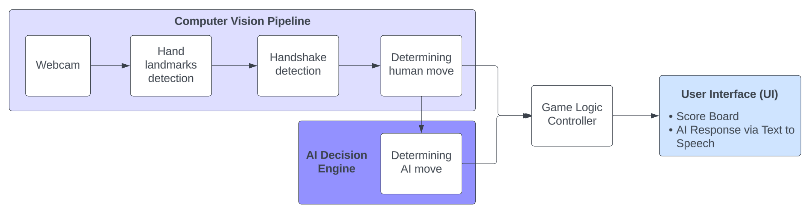
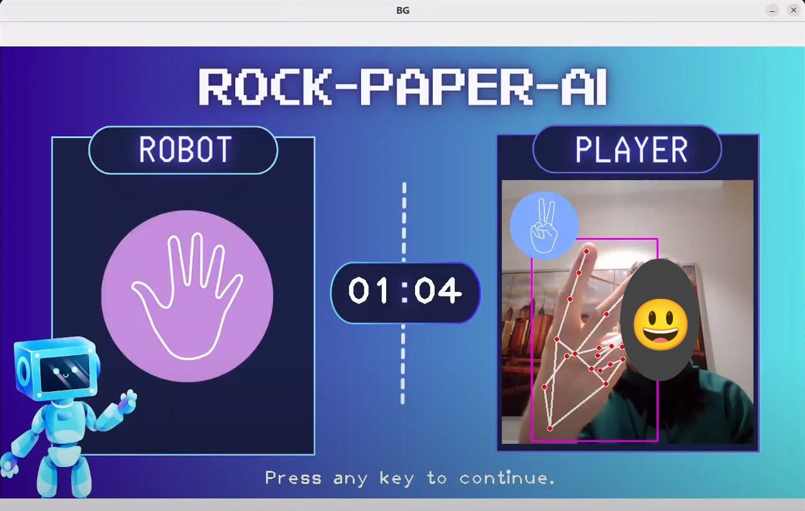

# Rock Paper AI

Play the rock paper scissors game against an AI!

## Abstract

We developed a Rock-Paper-Scissors game with Python and MediaPipe, where a human player plays against
different AI strategies (random move, 20 % cheated move, move determined using Markov chain). Human
moves are detected from live webcam images, AI moves are visualized using icons on the screen. 21 study
participants (N = 21) could play as long as they wanted, measuring the engagement time with a stopwatch. A
questionnaire was used to collect additional data. It was first supposed that the more intelligent the AI strategy
(Markov Chain > 20 % cheat > random move), the higher the engagement time will be. However,
the data collected shows the opposite result: the less intelligent and the more "fair" the AI strategy, the longer
the participants wanted to play. Additional data was analyzed, before and after playing the game, regarding
the confidence of playing Rock-Paper-Scissors, the emotions, and more.

## How to run?

Connect a camera to your machine. It is used to determine the player's move.

You can optionally use a virtualenv or Conda environment.

1. Install Python version 3
2. `pip install -U -r requirements.txt`
3. `python main.py`

## AI strategies

You can choose from the following strategies that the AI will follow to determine its move:

* Random (`RANDOM`)
* Cheat with 20% chance, such that it will win against the player (`SOMETIMES_CHEAT`)
* Markov chain approach based on the last and current player's move (`MARKOV_CHAIN`)

Currently, the AI strategy is set at the beginning of the `main.py` file.

## System architecture

## Screenshot of the user interface
